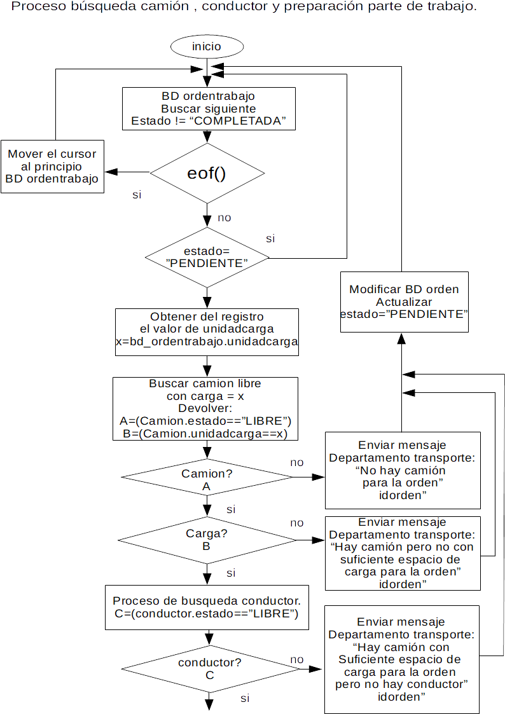
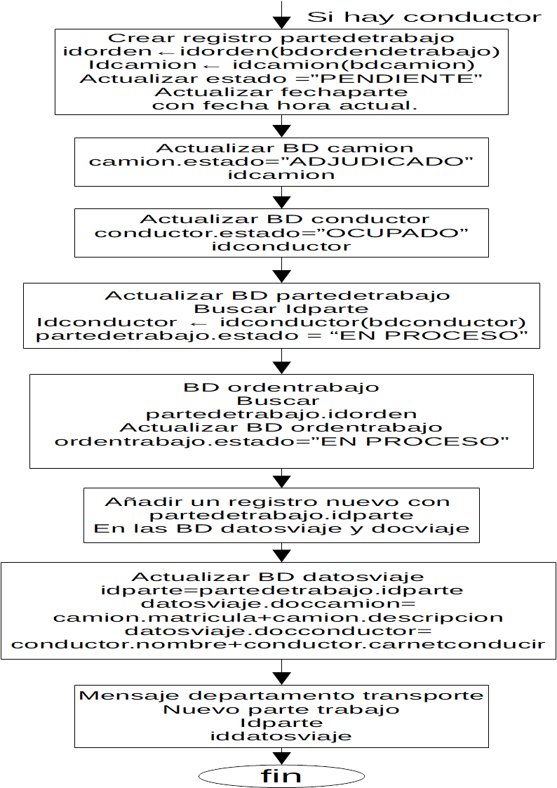

>En este diagrama de flujo se representa el proceso que se sigue cuando se ha validado una orden de trabajo y se ha creado un registro nuevo en la base de datos **ordentrabajo**.

>Si están disponibles todos los actores que se necesitan para hacer el transporte solicitado, se crea un nuevo registro en la base de datos **parte de trabajo**.

